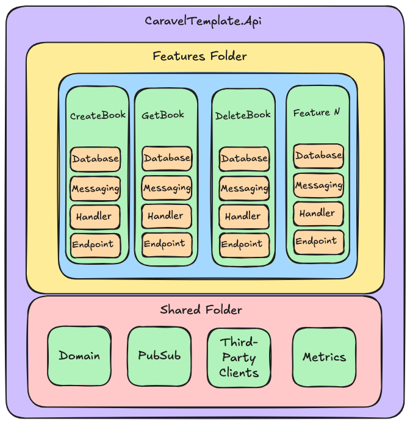

# Caravel Template Vertical Slice

This template uses Caravel package as an SDK and it bootstraps a full functional web api following the Vertical Slice Architecture:

* CaravelTemplate.Api - Single project containing the following main folders:
    * **Features** - Application features. e.g. create book, get book, etc.
    * **Shared** - Shared components. e.g. domain, database, clients, messaging, etc.
* CaravelTemplate.Migrator (A slim program to handle entity framework migrations)

### Pros & Cons

All software architectures have pros and cons:

* Cohesion ✅ - High cohesion within each slice as it encapsulates a feature end-to-end, making it easy to understand and maintain.
* Coupling ✅ - Low coupling within each slice and they can be development in parallel. Changes in one slice have minimal or no impact in others.
* Flexibility ✅ - Very flexible when adding or modifying features as each slice can be handled independently.
* Learning ✅ - It’s straightforward to understand the flow of individual slices due to the high cohesion.
* Modularity ✅ - High modularity with self-contained slices, in which can be developed and deployed independently.
* Simplicity 🟨 - Simple for small to medium projects. Complexity grows as the number of slices increases, but it is possible to extract features into separate modules to reduce it.
* Testability 🟨 - Easy to test end-to-end each slice independently but might require extra setup for shared components and infrastucture concerns.


 



### Features

* [Caravel SDK](https://github.com/talento90/caravel) (Errors, Middleware, Exceptions, MediatR Pipeline Behabiours)
* HTTP Api using Minimal APIs using the REPR (Request-Endpoint-Response) pattern.
* Business logic using CQRS pattern + pipeline behaviours  ([MediatR](https://github.com/jbogard/MediatR))
* Message bus using ([MassTransit](https://github.com/MassTransit/MassTransit))
* Observability + Dashboard using ([OpenTelemetry](https://github.com/open-telemetry/opentelemetry-dotnet)) and Aspire
* Entity Framework and Migrations using PostgreSQL
* Health Check mechanism
* OpenApi 3.0 Spec using [Swashbuckle](https://github.com/domaindrivendev/Swashbuckle)
* Docker and Docker Compose
* Logging using [Serilog](https://serilog.net/)
* Testing using [Bogus](https://github.com/bchavez/Bogus) (Fake data generator) + [Fluent Assertions](https://fluentassertions.com/) + [Test Containers](https://github.com/testcontainers/testcontainers-dotnet) + [Respawn](https://github.com/jbogard/Respawn) (Database Cleanup)


### Aspire Dashboard


## Installation

#### Download and Install Template
```bash
git clone git@github.com:Talento90/caravel-template-vertical-slice.git
dotnet new --install ~/caravel-template-vertical-slice
```

#### Generate Project
```bash
dotnet new caravel-template-vertical-slice -n MyProject -o ./
```
Note: `MyProject` is  going to replace the `CaravelTemplate`  

#### Run Web Api

`dotnet run --project src/MyProject.WebApi`

`open http://localhost:5000/swagger/index.html`


## Docker Compose

- Setup PostgreSql container
- Setup RabbitMQ container
- Setup Aspire Dashboard container

```bash
# Setup and run docker compose
docker compose up

# Remove containers
docker compose down
```

## Entity Framework Migrations

* **[Official Documentation](https://learn.microsoft.com/en-us/ef/core/cli/dotnet)**
* Setup database from scratch: `sh scripts/database-init.sh`

```bash
# Install dotnet-ef tool
dotnet tool install --global dotnet-ef

# Update dotnet-ef tool
dotnet tool update --global dotnet-ef

# List all migrations
dotnet ef migrations list --startup-project src/CaravelTemplate.Migrator --project src/CaravelTemplate.Api --context ApplicationDbContext --no-build

# Generate SQL Scripts
dotnet ef migrations script --startup-project src/CaravelTemplate.Migrator --project src/CaravelTemplate.Api --context ApplicationDbContext --no-build 

# Add new database migration changes to the Application DbContext
dotnet ef migrations add CreateApplicationSchema --startup-project src/CaravelTemplate.Migrator --output-dir Shared/Data/Migrations --project src/CaravelTemplate.Api --context ApplicationDbContext --no-build
 
# Apply the migration changes
dotnet ef database update --startup-project src/CaravelTemplate.Migrator --project src/CaravelTemplate.Api --context ApplicationDbContext --no-build 
```